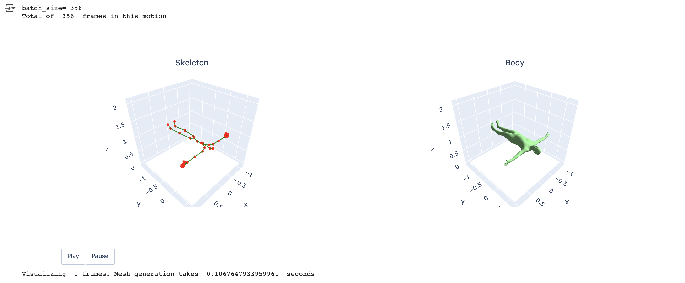
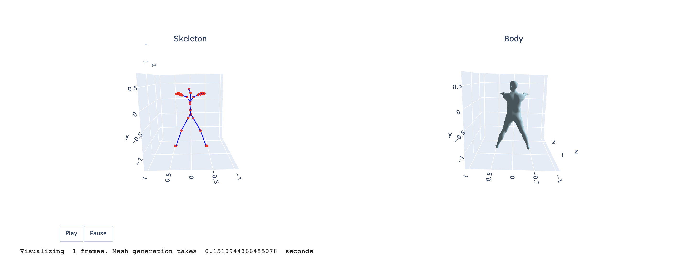
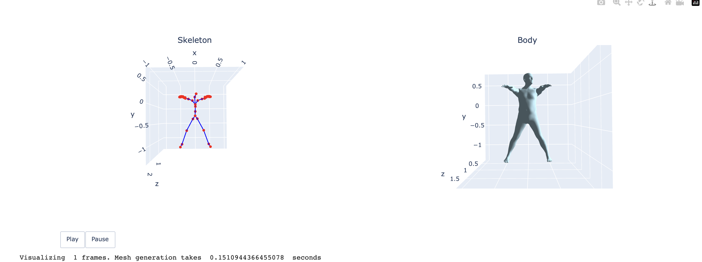

# A3
## Question 1
The default motion is **quick side step left_poses**, in the **left** direction of the model, which is **-x** in the coordinate.
## Question 2
The default T-pose faces towards +z position

## Question 3

